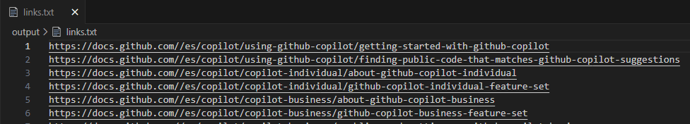
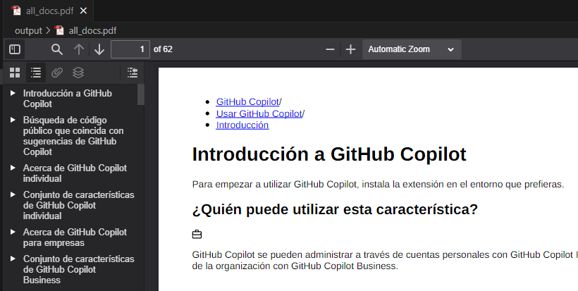

# github_doc

## Test on

WSL2 with Ubuntu 22.04

## Use

1. Install the requirements with `pip install -r requirements.txt`
2. Install wkhtmltopdf with the bash script `install_wkhtmltopdf.sh`
3. Get the links inside the url github doc with `get_links_docs_github.py`
4. Get all docs in pdf with `download_all_github_doc_pdf.py`
5. Watch inside the ouput path

## Images

